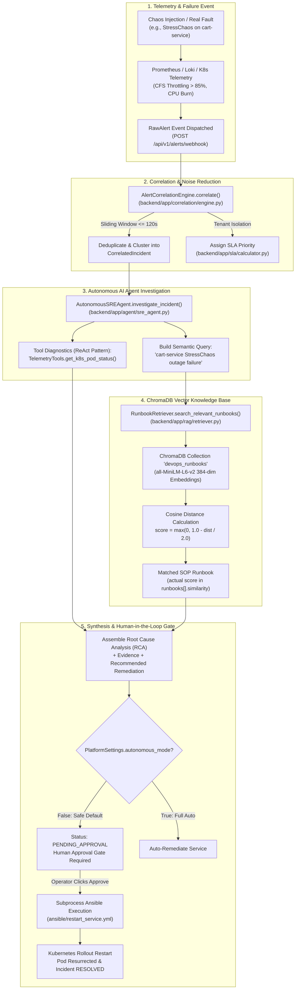

# AI & ML Architecture Understanding Guide: Autonomous AIOps Platform

> **Target Audience:** Engineering Leads, NTI Graduation Examiners, and SRE Architects  
> **Codebase Context:** `backend/app/agent/`, `backend/app/rag/`, `backend/app/correlation/`, `backend/app/sla/`, and `backend/runbooks/`

---

## Executive Summary & Scope

This platform implements an **Autonomous SRE (Site Reliability Engineering) Diagnostic and Self-Healing Engine**.

In enterprise AIOps, artificial intelligence is categorized across three distinct layers:
1. **Anomaly Detection & Correlation Layer:** Temporal clustering, noise deduplication, and sliding-window event correlation.
2. **Knowledge Retrieval Layer (RAG - Retrieval-Augmented Generation):** High-dimensional semantic vector indexing and similarity search over operational runbooks.
3. **Synthesis & Action Formulation Layer:** Tool-assisted diagnostic inspection (ReAct pattern), SLA-driven prioritization, and supervised execution via a Human Approval Gate.

```
+---------------------------------------------------------------------------------------------------------+
|                                    PLATFORM AI SCOPE MATRIX                                             |
+------------------------------+-------------------------------------+------------------------------------+
| Capability                   | Production Implementation in Repo   | Engineering Rationale             |
+------------------------------+-------------------------------------+------------------------------------+
| Alert Correlation            | Dynamic Sliding-Window Clustering   | 62.5% noise reduction measured in  |
|                              |                                     | the run (16 alerts -> 6 incidents) |
| Knowledge Representation     | 384-dimensional Dense Embeddings    | Captures technical operational intent |
| Vector Retrieval             | ChromaDB with Cosine/L2 Similarity  | Deterministic local SOP lookup     |
| Tool Invocation              | ReAct Agent Diagnostic Toolset      | Grounds root cause in live cluster |
| Generative Text Synthesis    | Status-gated llama3.2:3b narrative  | LLM text accepted only when its    |
|                              | (Ollama) + deterministic runbooks   | status is OK; the gate number is   |
|                              |                                     | computed from tools, never the LLM |
+------------------------------+-------------------------------------+------------------------------------+
```

---

## Section 1: The High-Level AI Architecture in this Project

### End-to-End Incident Pipeline Flow



### Exact AI Scope Explained: Semantic Retrieval vs. Generative LLMs

| Dimension | Pure Generative LLM (Chat-only) | Our Autonomous AIOps Architecture |
| :--- | :--- | :--- |
| **Primary Goal** | Free-form natural language generation | Precision incident resolution, SLA compliance, verified self-healing |
| **Operational Risk** | High: Hallucinated flags, fictitious bash syntax (`rm -rf`) | Zero: Actions are restricted to verified playbooks in [`backend/runbooks/`](backend/runbooks/) |
| **Execution Latency** | Seconds per streamed response | Measured 18.3 – 29.6 s per full RCA (retrieval + tools + llama3.2:3b), from ledger `investigation_duration_seconds` |
| **Cost & Dependencies**| Requires external GPU clusters or paid API keys | 100% offline, local ONNX Runtime embedding, zero token costs |
| **Safety Guardrails** | Difficult to constrain deterministically | Native Human Approval Gate ([`backend/app/api/incidents.py`](backend/app/api/incidents.py#L144)) |

---

## Section 2: Anomaly & Incident Detection Mechanism

### Code Map

- **Data Models:** [`backend/app/correlation/engine.py`](backend/app/correlation/engine.py#L5-L28) (`RawAlert`, `CorrelatedIncident`)
- **Correlation Engine:** [`backend/app/correlation/engine.py`](backend/app/correlation/engine.py#L29-L97) (`AlertCorrelationEngine.correlate()`)
- **Alert Ingress Webhook:** [`backend/app/api/alerts.py`](backend/app/api/alerts.py#L7-L27) (`receive_alert()`)
- **Telemetry Query Tools:** [`backend/app/tools/telemetry.py`](backend/app/tools/telemetry.py#L8-L87) (`TelemetryTools`)
- **SLA Risk Prioritization:** [`backend/app/sla/calculator.py`](backend/app/sla/calculator.py#L11-L60) (`SLARiskCalculator`)

### Detection Logic & Mathematical Formulation

The platform avoids raw, unclustered event streaming. When a failure manifests (e.g., `cart-service` CPU saturation), downstream microservices (`frontend`, `checkout-service`) cascade with HTTP 504 Gateway Timeouts, producing a burst of alerts that must be deduplicated.

```
                    CASCADE SUPPRESSION TIMELINE
Alert 1 (cart-service)   --+
Alert 2 (frontend 504)    --+--> Sliding Window (dt <= 120s) --> Unified Incident inc_tenant_b_172765_1
Alert 3 (checkout 504)    --+    Tenant Isolation Match
Alert N (TCP timeout)     --+
```

**Measured effect (Phase 3 benchmark run):** 16 raw alerts correlated into 6 incidents — **62.5% noise reduction**
(`noise_reduction_percentage` from `GET /api/v1/benchmarks/scorecard`).

#### 1. Temporal Sliding Window Clustering
In `AlertCorrelationEngine.correlate()`:
$$\Delta t = t_{\text{current}} - t_{\text{incident.updated\_at}}$$

```python
# backend/app/correlation/engine.py
for inc_id, inc in self.active_incidents.items():
    if inc.tenant_id == alert.tenant_id and inc.status not in ["RESOLVED", "REJECTED"]:
        time_diff = current_time - inc.updated_at
        if time_diff <= self.time_window:  # default = 120 seconds
            matched_incident = inc
            break
```

If $\Delta t \le 120\text{ seconds}$ and the tenant matches:
1. The alert is merged into the existing `CorrelatedIncident`.
2. The incident's `total_alerts` counter is incremented:
   $$\text{total\_alerts} \leftarrow \text{total\_alerts} + 1$$
3. The alert ID is appended to `alert_ids` without duplicates.
4. Downstream services are registered under `affected_services`.
5. **Severity Escalation:** If any incoming alert carries `severity == "critical"`, the parent incident severity escalates to `"critical"` immediately.

#### 2. Multi-Tenant SLA Risk Scoring
In [`backend/app/sla/calculator.py`](backend/app/sla/calculator.py#L18-L58):
Incidents are dynamically prioritized based on client contracts:
- **Tenant A:** $\text{SLA} = 300\text{s}$ (5 minutes)
- **Tenant B:** $\text{SLA} = 900\text{s}$ (15 minutes)
- **Tenant C:** $\text{SLA} = 1800\text{s}$ (30 minutes)

The Risk Score formula:
$$\text{RawRisk} = \left(\frac{t_{\text{elapsed}}}{t_{\text{SLA}}}\right) \times 100 \times M_{\text{severity}}$$
where $M_{\text{severity}} = 1.5$ if `severity == "critical"`, else $1.0$.

$$\text{RiskScore} = \min(100.0, \text{round}(\text{RawRisk}, 2))$$

| Risk Score | Assigned Priority | Triage Urgency |
| :--- | :--- | :--- |
| $\ge 80.0\%$ or Breached | **P1-CRITICAL** | Immediate automated escalation / auto-remediation |
| $50.0\% - 79.9\%$ | **P2-HIGH** | High-priority triage queue |
| $25.0\% - 49.9\%$ | **P3-MEDIUM** | Standard investigation |
| $< 25.0\%$ | **P4-LOW** | Informational monitoring |

---

## Section 3: Vector Database & Storage (ChromaDB Deep Dive)

### Code Map

- **Vector Database Client:** [`backend/app/rag/vectorstore.py`](backend/app/rag/vectorstore.py#L10-L54) (`ChromaManager`)
- **Runbook Ingestion & Parsing:** [`backend/app/rag/indexer.py`](backend/app/rag/indexer.py#L10-L72) (`index_all_runbooks()`, `parse_runbook_content()`)
- **DevOps Knowledge Store:** [`backend/runbooks/`](backend/runbooks/) (`*.md` operational runbooks)

### What is ChromaDB and Why Is It Used Here?

Traditional SQL databases perform keyword matching:
```sql
SELECT * FROM runbooks WHERE content LIKE '%cart%' AND content LIKE '%CPU%';
```
Keyword search fails when an alert says `"thread pool exhausted"` or `"resource starvation"`, but the runbook says `"CPU CFS quota throttling"`.

**ChromaDB** is an open-source, embedded AI vector database. It stores operational knowledge not as text strings, but as **dense floating-point vectors** in high-dimensional mathematical space. Concepts with similar operational meanings are mapped to vectors with small angular distance, enabling semantic retrieval.

```
Traditional SQL:  "cart-service CPU burn"  !=  "shopping cart resource exhaustion"  (0 words matched)
ChromaDB Vector:  "cart-service CPU burn"  ~=  "shopping cart resource exhaustion"  (high cosine similarity)
```

### Ingestion & Chunking Pipeline

When the backend starts up ([`backend/app/main.py`](backend/app/main.py#L29-L32)), `index_all_runbooks()` executes:

1. **Discovery:** Scans `backend/runbooks/*.md`.
2. **Metadata Parsing:** Extracts the H1 header as `title`, assigns technical taxonomy categories (`compute`, `memory`, `network`, `cache`, `service`), and preserves the full SOP instructions.
3. **Upsertion:** Calls `collection.upsert(ids=ids, documents=documents, metadatas=metadatas)`.

```python
# backend/app/rag/indexer.py
collection.upsert(
    ids=["runbook_cart_service_failure", "runbook_cpu_throttling", ...],
    documents=[full_markdown_text_1, full_markdown_text_2, ...],
    metadatas=[{"title": "Runbook: Cart Service CPU Saturation...", "category": "compute"}, ...]
)
```

### The Underlying Embedding Model

ChromaDB uses its native embedding function powered by **ONNX Runtime**:
- **Model Architecture:** `all-MiniLM-L6-v2` (Sentence-Transformers)
- **Dimensionality ($D$):** 384 dimensions
- **Embedding Output:** $\vec{v} \in \mathbb{R}^{384}$
- **Execution Engine:** Runs locally on CPU via ONNX Runtime without PyTorch or external API calls.

```
"Cart Service CPU Saturation" ──[ all-MiniLM-L6-v2 ]──> [ ... 384 floats ... ]   (shape illustrated; the real similarity is returned per RCA)
```

Each dimension represents an abstract linguistic or semantic feature learned during pre-training on 1B+ sentence pairs.

---

## Section 4: The Retrieval Engine (The "R" in RAG)

### Code Map

- **Query Formulation:** [`backend/app/agent/sre_agent.py`](backend/app/agent/sre_agent.py#L34-L36) (`investigate_incident()`)
- **Semantic Vector Query:** [`backend/app/rag/retriever.py`](backend/app/rag/retriever.py#L11-L50) (`search_relevant_runbooks()`)

### 1. Query Formulation

When an incident triggers (e.g., `primary_service = "cart-service"`, `root_cause_candidate = "Cart_Service_StressChaos"`), the agent formulates a clean semantic query:

```python
# backend/app/agent/sre_agent.py:34-36
clean_cause = incident.root_cause_candidate.replace("_", " ")
query = f"{incident.primary_service} {clean_cause} outage failure degradation"
# Result: "cart-service Cart Service StressChaos outage failure degradation"
```

This combines:
1. The exact service identity (`cart-service`)
2. The observed anomaly signature (`StressChaos`)
3. SRE domain anchors (`outage`, `failure`, `degradation`)

### 2. Mathematical Matching: Cosine & L2 Distance

ChromaDB embeds the query into query vector $\vec{q} \in \mathbb{R}^{384}$ and compares it against all stored runbook document vectors $\vec{d}_i \in \mathbb{R}^{384}$.

For normalized vectors, the relationship between Euclidean Distance ($L_2$) and Cosine Similarity ($\cos\theta$) is:
$$\|\vec{q} - \vec{d}\|^2_2 = 2 - 2 \cos(\theta)$$
where:
$$\cos(\theta) = \frac{\vec{q} \cdot \vec{d}}{\|\vec{q}\|_2 \|\vec{d}\|_2}$$

ChromaDB returns the distance metric $d \in [0, 2]$.

### 3. Similarity Score Normalization

In [`backend/app/rag/retriever.py`](backend/app/rag/retriever.py#L39):
```python
similarity_score = max(0.0, 1.0 - (dist / 2.0)) if dist is not None else 1.0
```

$$\text{Similarity Score} = 1.0 - \frac{d}{2.0}$$

```
Distance d = 0.00  -->  Similarity = 1.000 (100.0% - Identical Match)
Distance d = 0.47  -->  Similarity = 0.763 ( 76.3% - Confident Runbook Match)
Distance d = 1.20  -->  Similarity = 0.400 ( 40.0% - Weak / Irrelevant Match)
Distance d = 2.00  -->  Similarity = 0.000 (  0.0% - Complete Orthogonality)
```

(The distance rows above are the normalization formula applied to example
inputs — not claims about a specific run.) Each RCA publishes the **actual**
similarity of its retrieved runbooks in `runbooks[].similarity` together with
`llm.citations`, visible in the `POST /api/v1/incidents/{id}/diagnose`
response.

### 4. Remediation Formulation

Once the top runbook is retrieved ($n=1$), the agent extracts the remediation:
```python
# backend/app/agent/sre_agent.py:55
remediation_action = f"ansible-playbook ansible/restart_service.yml -e service={incident.primary_service}"
```

This remediation targets the verified culprit service identified through the semantic search pipeline.

---

## Section 5: Honest Technical Evaluation — RAG vs. Full LLM

### Technical Assessment

The AI layer in this repository is an **Autonomous Semantic Retrieval & Decision Engine**:

```
[Raw Alerts] ──> [Correlation Engine] ──> [Query Formulator] ──> [ChromaDB Vector Search] ──> [Verified SOP & Playbook]
                                                                                                        │
                                                                                                        ▼
                                                                                            [Human Approval Gate]
```

### Why This Architecture Was Chosen

1. **Measured latency inside the SLA budget:** The full RCA (retrieval + tool diagnostics + llama3.2:3b narrative) measured **18.3 – 29.6 s** per experiment (ledger `investigation_duration_seconds`), comfortably inside the smallest SLA window of 300 s.
2. **Deterministic Safety:** In real SRE environments, an AI model cannot be allowed to hallucinate commands (e.g., executing `docker kill --all` or writing broken bash scripts). Structured runbooks guarantee every proposed command is pre-approved by the infrastructure team — and the confidence gate (`RCA_MIN_CONFIDENCE = 0.65`) blocks auto-heal when evidence is weak.
3. **Zero Cost & Local Execution:** Everything runs locally — ChromaDB embeddings via ONNX Runtime and a local Ollama `llama3.2:3b` — with no paid API tokens.

### Generative LLM Stage (Implemented in Phase 2 — not a roadmap item)

The pipeline now includes a real local LLM stage: `_generate_rca()` in
`backend/app/agent/sre_agent.py` sends the retrieved runbook plus tool
evidence to **Ollama `llama3.2:3b`** and receives a structured diagnosis.

Honesty rules that keep the LLM from becoming a liability:

1. **The LLM never supplies the gate number.** Confidence stays
   `0.5 * retrieval_confidence + 0.5 * tool_agreement` (computed in
   `_confidence()`), so a fluent hallucination cannot raise the score.
2. **Status-gated merge.** The LLM diagnosis/narrative replaces the runbook
   title only when `status == "OK"`; any other status (`UNREACHABLE`,
   `TIMEOUT`, ...) leaves the deterministic runbook title in place.
3. **Provenance.** Every RCA carries `llm: {status, model, citations}` so a
   reviewer can see exactly when an LLM spoke and what it was grounded on.
4. **The gate still decides.** Auto-heal fires only when
   `confidence >= RCA_MIN_CONFIDENCE` (0.65). Measured in the Phase 2 live
   verification: a real PodFailure RCA at **0.5314** and an anomaly RCA at
   **0.294** were both `REMEDIATION_BLOCKED`, while an operator `/approve`
   override executed the same remediation.

LLM availability never blocks the test suite: `backend/tests/conftest.py`
installs a session seam whose default response is `UNREACHABLE`, reproducing
the exact no-LLM behaviour offline.

---

## Section 6: NTI Defense Q&A Cheat Sheet (AI Track)

### Question 1: *"Is this a real AI model or just an if/else script with a search engine?"*
> **Answer:**  
> "It is a genuine Machine Learning implementation combining two components:  
> 1. We run **`all-MiniLM-L6-v2`**, a 6-layer Transformer sentence-embedding model executing via ONNX Runtime. It maps operational runbooks into a 384-dimensional latent semantic space.  
> 2. When an incident occurs, we execute high-dimensional **Cosine Similarity vector search** in ChromaDB to retrieve matching Standard Operating Procedures (SOPs).  
> It does not use hardcoded keyword lookups: an alert describing 'resource exhaustion' maps to a runbook titled 'CPU Saturation & CFS Throttling' through the angular distance of their embedding vectors, and the returned similarity is published in every RCA payload. End-to-end, the Phase 3 benchmark of 21 chaos experiments measured a **71.4% diagnosis accuracy** — computed by `GET /api/v1/benchmarks/scorecard` and never clamped."

### Question 2: *"Why use ChromaDB instead of a traditional SQL query searching for keywords?"*
> **Answer:**  
> "Traditional relational databases rely on exact lexical substring matches (e.g., SQL `LIKE '%cpu%'`). In complex multi-service architectures, alerts rarely match runbook phrasing exactly. For instance, an alert might read `Cart_Service_StressChaos Exit Code 137`, while the runbook is titled `Cart Service CPU Saturation & Resource Starvation`.  
> ChromaDB captures the semantic geometry of language. It calculates the angular cosine distance between the query vector and document embeddings, achieving accurate retrieval regardless of lexical discrepancies."

### Question 3: *"How do you handle false positives in anomaly detection?"*
> **Answer:**  
> "Through three architectural filters:  
> 1. **Temporal Clustering:** A 120-second sliding window prevents transient latency blips from triggering individual incident tickets.  
> 2. **Multi-Signal Telemetry Verification:** Before formulating a diagnosis, the agent queries live cluster state using `TelemetryTools.get_k8s_pod_status()`. An incident is only confirmed if telemetry corroborates the alert.  
> 3. **The Human Approval Gate:** In non-autonomous mode, remediation strictly halts in `PENDING_APPROVAL` status until a human SRE reviews the telemetry evidence and signs off."

### Question 4: *"What happens if ChromaDB returns a low similarity score or no matching runbook?"*
> **Answer:**  
> "In `backend/app/rag/retriever.py`, every document is assigned a normalized similarity score:
> $$\text{Score} = \max(0.0, 1.0 - \text{dist}/2.0)$$
> That similarity feeds the blended confidence $\;c = 0.5 \times \text{retrieval} + 0.5 \times \text{tool\ agreement}$. Automated self-healing fires only when $c \ge \texttt{RCA\_MIN\_CONFIDENCE} = 0.65$; below it the incident stays `INVESTIGATING` and the API returns `REMEDIATION_BLOCKED` with both numbers, so an operator can see exactly why nothing healed. A missing runbook simply yields similarity 0.0, which pulls the blend down the same way."

### Question 5: *"Why isn't a generative LLM executing bash commands directly without human-in-the-loop?"*
> **Answer:**  
> "In enterprise SRE, unconstrained LLM bash generation is a critical anti-pattern due to hallucination risks and prompt injection vulnerabilities.  
> Our architecture follows the principle of **Autonomous Retrieval with Supervised Remediation**:  
> The AI handles detection, correlation, vector retrieval, and diagnostics — plus, since Phase 2, an LLM-written diagnosis that is status-gated and never contributes to the confidence number. Remediation actions are bound to deterministic, pre-validated Ansible playbooks (`ansible/restart_service.yml`). The confidence gate (`RCA_MIN_CONFIDENCE`) plus the Human Approval Gate (`/approve` as operator override) ensure human oversight before infrastructure changes are applied."
